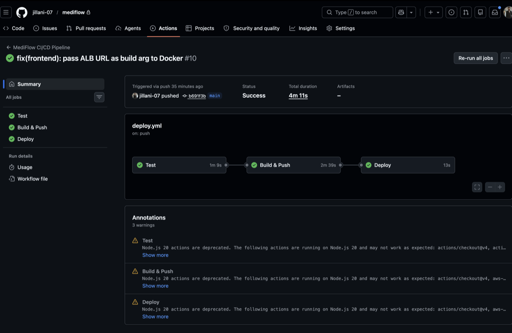

# MediFlow 🏥

MediFlow is a Healthtech platform engineered to reflect real-world Cloud & DevOps practices — infrastructure provisioning, containerization, automated deployment, security hardening, and monitoring.

> **Focus:** Cloud & DevOps — AWS · Docker · Terraform · GitHub Actions  
> **Status:** Live on AWS · Actively adding features

---

## Live Demo

**URL:** http://mediflow-alb-669746895.ap-south-1.elb.amazonaws.com

| Credential | Value |
|---|---|
| Email | admin@mediflow.com |
| Password | Admin1234 |


---

## Architecture


```
Browser
    ↓
ALB (Application Load Balancer)
    ├── /*      → Frontend container (React + Nginx)  :80
    └── /api/*  → Backend container (NestJS)          :3001
                        ↓
                RDS PostgreSQL  (private subnet — no internet access)
                S3 Bucket       (encrypted file storage)
                Secrets Manager (runtime credentials)
```

---

## Tech Stack

| Layer | Technology |
|---|---|
| Frontend | React 18, TypeScript, Tailwind CSS, React Query |
| Backend | NestJS, TypeORM, PostgreSQL |
| Auth | JWT (8h expiry), bcrypt (12 rounds) |
| Cloud | AWS — EC2, RDS, S3, ECR, ALB, IAM, SSM, Secrets Manager, CloudWatch |
| IaC | Terraform — modular |
| Containers | Docker — multi-stage builds |
| CI/CD | GitHub Actions |
| Monitoring | CloudWatch — CPU alarms, 7-day log retention |

---

## Infrastructure — Terraform

All AWS resources provisioned via Terraform modules. No manual console clicks.

```
infrastructure/
└── modules/
    ├── vpc/   → VPC, public/private subnets, IGW, route tables
    ├── ec2/   → EC2, IAM role, security groups, user_data bootstrap
    ├── rds/   → PostgreSQL 16, private subnet, encrypted storage
    ├── s3/    → Private bucket, AES-256, versioning enabled
    └── alb/   → ALB, target groups, listener rules (/api/* routing)
```

**Network design:**
- Public subnets — EC2, ALB (internet-facing)
- Private subnets — RDS (no internet route)

**Security groups — least privilege:**
- ALB SG → accepts 80 from internet only
- EC2 SG → accepts traffic from ALB SG only
- RDS SG → accepts 5432 from EC2 SG only

---

## CI/CD Pipeline — GitHub Actions

```
git push → main
    ↓
Job 1 — Test
    ├── npm build (frontend + backend)
    └── TypeScript type check + lint
    ↓
Job 2 — Build & Push
    ├── docker build --target production (multi-stage)
    ├── push to AWS ECR (tagged with git SHA)
    └── ECR CVE vulnerability scan on every push
    ↓
Job 3 — Deploy
    ├── aws ssm send-command → EC2 (no SSH, no open ports)
    ├── docker pull latest from ECR
    └── docker-compose up -d --remove-orphans

Total: ~4 minutes from push to live
```



---

## Security

| Decision | Implementation |
|---|---|
| No SSH access | AWS SSM Session Manager — port 22 never opened |
| No hardcoded secrets | AWS Secrets Manager — pulled at runtime |
| Network isolation | RDS in private subnet — EC2 is only allowed ingress |
| IAM least privilege | EC2 role scoped to S3 + SSM + Secrets Manager only |
| Encrypted storage | EBS gp3 encrypted, RDS encrypted, S3 AES-256 |
| Image security | ECR CVE scan on every push |
| API protection | Helmet headers, rate limiting (100 req/min), JWT auth |

---

## Local Development

```bash
git clone https://github.com/jillani-07/mediflow.git
cd mediflow

cp backend/.env.example backend/.env
cp frontend/.env.example frontend/.env
# fill in values

docker-compose up
```

| Service | URL |
|---|---|
| Frontend | http://localhost:3000 |
| Backend API | http://localhost:3001/api/v1 |
| Swagger docs | http://localhost:3001/api/docs |

---

## Project Structure

```
mediflow/
├── frontend/              # React + TypeScript
├── backend/               # NestJS + TypeORM
│   └── src/
│       ├── modules/       # auth, users, patients, appointments
│       ├── common/        # guards, filters, interceptors
│       └── config/        # app, database config
├── infrastructure/        # Terraform
│   └── modules/           # vpc, ec2, rds, s3, alb
├── .github/workflows/     # GitHub Actions CI/CD
└── docker-compose.yml     # Local development
```

---

## Roadmap

- [ ] Patient registration + appointment scheduling forms
- [ ] HTTPS — ACM certificate with custom domain
- [ ] Auto Scaling Group — scale EC2 on CPU threshold
- [ ] S3 file upload — patient document storage
- [ ] CloudWatch dashboard — metrics visualization