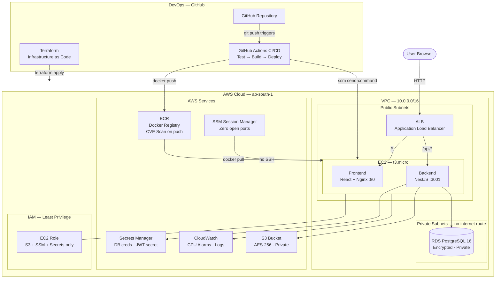
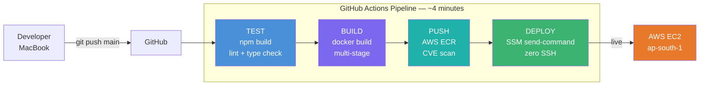
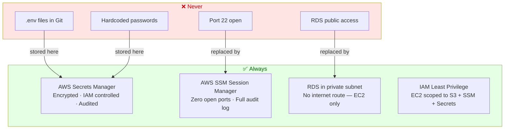
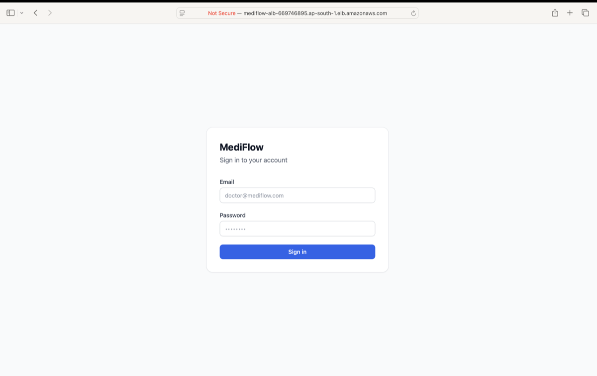
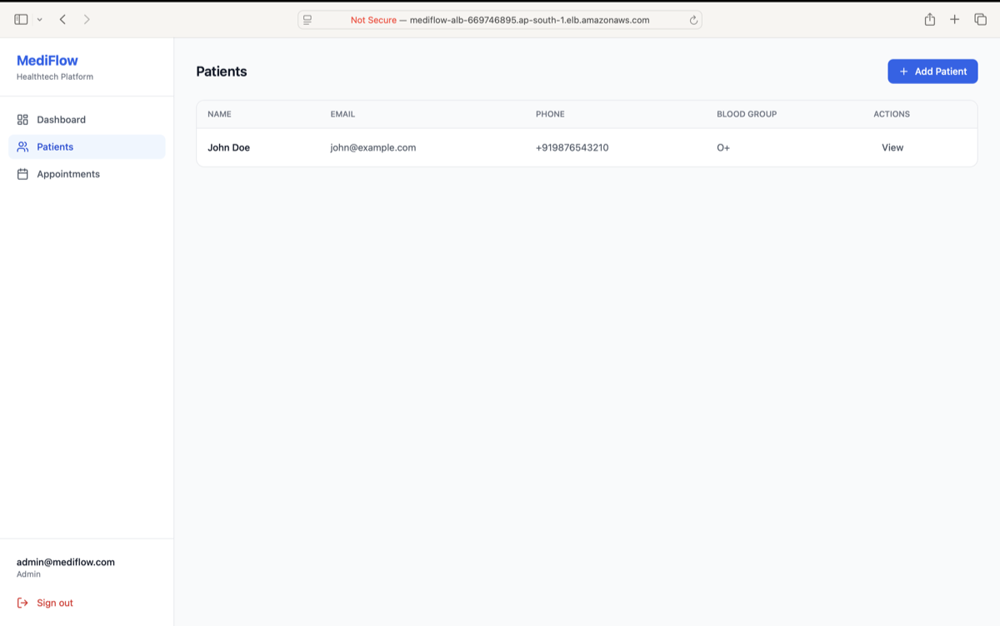

# MediFlow 🏥

> AWS-based Cloud & DevOps implementation project focused on infrastructure automation, CI/CD pipelines, containerized deployments, and cloud security best practices.

**Live:** http://mediflow-alb-669746895.ap-south-1.elb.amazonaws.com


---

## Overview

MediFlow is a Healthtech platform for managing patients and appointments. The project exists to demonstrate end-to-end Cloud & DevOps ownership — not just writing application code, but provisioning infrastructure as code, securing it properly, and shipping it automatically with every git push.

**Why this project exists:** To prove that real DevOps decisions — network isolation, zero SSH access, secret management, image scanning — can be applied outside a corporate environment.

---

## Architecture



---

## CI/CD Pipeline



---

## Tech Stack

| Layer | Technology | Why |
|---|---|---|
| Frontend | React 18, TypeScript, Tailwind CSS | Fast UI, type-safe |
| Backend | NestJS, TypeORM | Modular, decorator-based REST API |
| Database | PostgreSQL 16 | UUID, relational, production-grade |
| Auth | JWT 8h expiry, bcrypt 12 rounds | Stateless, secure password hashing |
| Containers | Docker multi-stage builds | Small images, no dev deps in prod |
| Registry | AWS ECR | Private, CVE scan on every push |
| Deployment | AWS EC2 + docker-compose | Full control, Dockerized |
| Load Balancer | AWS ALB | Health checks, /api/* routing |
| Database hosting | AWS RDS | Managed, encrypted, private subnet |
| Secrets | AWS Secrets Manager | Zero plaintext credentials |
| Server access | AWS SSM | No SSH, IAM-controlled, audited |
| IaC | Terraform — modular | Reproducible, versioned infra |
| CI/CD | GitHub Actions | Automated test → build → deploy |
| Monitoring | CloudWatch | CPU alarms, 7-day log retention |
| File storage | S3 | Private, AES-256, versioned |

---

## Security.



**Additional hardening:**
- EBS gp3 encrypted at rest
- RDS storage encrypted
- S3 AES-256 + versioning + public access blocked
- ECR CVE vulnerability scan on every image push
- API rate limiting — 100 req/min per IP
- HTTP security headers via Helmet
- JWT authentication on all protected routes

---

## Infrastructure — Terraform

All AWS resources provisioned via Terraform. Zero manual console clicks.

```
infrastructure/
└── modules/
    ├── vpc/   → VPC, public/private subnets, IGW, route tables
    ├── ec2/   → EC2, IAM role, instance profile, security groups
    ├── rds/   → PostgreSQL 16, private subnet, encrypted
    ├── s3/    → Private bucket, AES-256, versioning
    └── alb/   → ALB, target groups, /api/* listener rules
```

**Security group chain — least privilege:**

```
Internet → ALB SG (80/443)
               ↓
           EC2 SG (from ALB SG only)
               ↓
           RDS SG (5432 from EC2 SG only)
```

---

## Screenshots

> Login Page



> Dashboard — live data from RDS


> Patients



> GitHub Actions — CI/CD Pipeline


> AWS EC2 Console


---

## Local Development

**Prerequisites:** Docker Desktop, Node.js 20+

```bash
git clone https://github.com/jillani-07/mediflow.git
cd mediflow

cp backend/.env.example backend/.env
cp frontend/.env.example frontend/.env
# fill in values

docker-compose up
```

| Service | URL |
|---|---|
| Frontend | http://localhost:3000 |
| Backend API | http://localhost:3001/api/v1 |
| Swagger docs | http://localhost:3001/api/docs |

---

## Project Structure

```
mediflow/
├── frontend/              # React + TypeScript + Tailwind
├── backend/               # NestJS + TypeORM
│   └── src/
│       ├── modules/       # auth, users, patients, appointments
│       ├── common/        # guards, filters, interceptors
│       └── config/        # app, database config
├── infrastructure/        # Terraform
│   └── modules/           # vpc, ec2, rds, s3, alb
├── .github/workflows/     # GitHub Actions CI/CD
└── docker-compose.yml     # Local development
```

---

## Roadmap

- [ ] Patient registration + appointment scheduling forms
- [ ] HTTPS — ACM certificate with custom domain
- [ ] Auto Scaling Group — scale on CPU threshold
- [ ] S3 file upload — patient document storage
- [ ] CloudWatch dashboard — metrics visualization
- [ ] Terraform remote state — S3 backend

---

## Author

**Jillani Ansari** — Cloud & DevOps Engineer

[LinkedIn](https://linkedin.com/in/jillani05) · [GitHub](https://github.com/jillani-07)