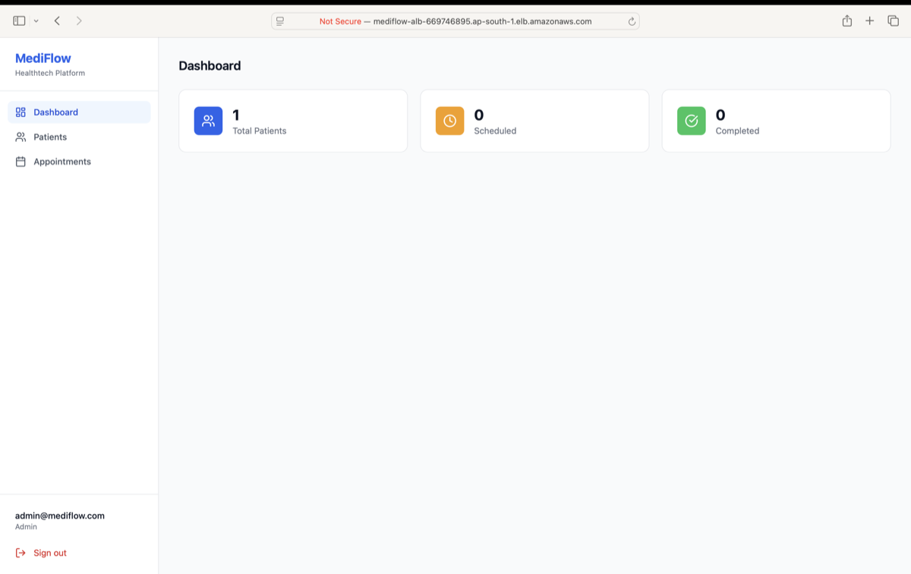

# MediFlow 🏥

MediFlow is a Healthtech platform engineered to reflect real-world Cloud & DevOps practices — covering infrastructure provisioning, containerization, automated deployment pipelines, security hardening, and production monitoring.

> **Focus:** Cloud & DevOps (AWS + Docker + Terraform + GitHub Actions)
> **Status:** Live on AWS — actively adding features

**Live:** http://mediflow-alb-669746895.ap-south-1.elb.amazonaws.com

---

## Architecture Overview
Browser
↓
ALB (Application Load Balancer)
├── /* → Frontend container (React + Nginx) → port 80
└── /api/* → Backend container (NestJS) → port 3001
↓
RDS PostgreSQL (private subnet — no internet access)
S3 (encrypted file storage)
Secrets Manager (runtime credentials)



---

## Infrastructure — Terraform (IaC)

All AWS resources provisioned via Terraform modules — no manual console clicks.
infrastructure/
├── modules/
│   ├── vpc/    → VPC, public/private subnets, IGW, route tables
│   ├── ec2/    → EC2, IAM role, security groups, user_data bootstrap
│   ├── rds/    → PostgreSQL, subnet group, encryption
│   ├── s3/     → Private bucket, AES-256, versioning
│   └── alb/    → ALB, target groups, listener rules
**VPC design:**
- Public subnets — EC2, ALB (internet-facing)
- Private subnets — RDS (no internet route)

**Security groups — least privilege:**
- ALB SG → accepts 80 from internet
- EC2 SG → accepts traffic from ALB SG only
- RDS SG → accepts 5432 from EC2 SG only

---

## CI/CD Pipeline — GitHub Actions
git push → main
↓
Job 1 — Test
└── npm build (frontend + backend)
└── TypeScript type check + lint
↓ (only if test passes)
Job 2 — Build & Push
└── docker build --target production (multi-stage)
└── push to AWS ECR (tagged with git SHA)
└── ECR CVE vulnerability scan on push
↓ (only if build passes)
Job 3 — Deploy
└── aws ssm send-command → EC2
└── docker pull latest from ECR
└── docker-compose up -d --remove-orphans
└── docker image prune (cleanup)
Total pipeline time — ~4 minutes from push to live.

---

## Security Implementation

| Decision | Implementation |
|---|---|
| No SSH access | AWS SSM Session Manager — port 22 never opened |
| No hardcoded secrets | AWS Secrets Manager — pulled at runtime |
| Network isolation | RDS in private subnet — EC2 is only allowed ingress |
| IAM least privilege | EC2 role allows only S3 + SSM + Secrets Manager |
| Encrypted storage | EBS gp3 encrypted, RDS storage encrypted, S3 AES-256 |
| Image security | ECR CVE scan triggered on every push |
| API protection | Helmet headers, rate limiting (100 req/min), JWT auth |

---

## Docker — Multi-stage Builds

```dockerfile
# Stage 1 — Build (includes dev dependencies)
FROM node:20-alpine AS builder
WORKDIR /app
COPY package*.json ./
RUN npm ci
COPY . .
RUN npm run build

# Stage 2 — Production (only runtime, no dev deps)
FROM node:20-alpine AS production
COPY --from=builder /app/dist ./dist
CMD ["node", "dist/main.js"]
```

Result — production image is ~180MB vs ~900MB full image.

---

## Tech Stack

| Layer | Technology |
|---|---|
| Frontend | React 18, TypeScript, Tailwind CSS, React Query |
| Backend | NestJS, TypeORM, PostgreSQL |
| Auth | JWT (8h expiry), bcrypt (12 rounds) |
| Cloud | AWS — EC2, RDS, S3, ECR, ALB, IAM, SSM, Secrets Manager, CloudWatch |
| IaC | Terraform — modular, versioned |
| Containers | Docker, docker-compose |
| CI/CD | GitHub Actions |
| Monitoring | CloudWatch alarms (CPU > 80%), 7-day log retention |

---

## Local Development

```bash
git clone https://github.com/YOUR_USERNAME/mediflow.git
cd mediflow

cp backend/.env.example backend/.env
cp frontend/.env.example frontend/.env
# fill in values

docker-compose up
```

| Service | URL |
|---|---|
| Frontend | http://localhost:3000 |
| Backend API | http://localhost:3001/api/v1 |
| Swagger docs | http://localhost:3001/api/docs |

---

## Project Structure
mediflow/
├── frontend/              # React + TypeScript
├── backend/               # NestJS + TypeORM
│   └── src/
│       ├── modules/       # auth, users, patients, appointments
│       ├── common/        # guards, filters, interceptors
│       └── config/        # app, database config
├── infrastructure/        # Terraform
│   └── modules/           # vpc, ec2, rds, s3, alb
├── .github/workflows/     # GitHub Actions CI/CD
└── docker-compose.yml     # Local development

---

## Roadmap

- [ ] Patient registration + appointment forms
- [ ] HTTPS — ACM certificate with custom domain
- [ ] Auto Scaling Group — scale EC2 on CPU threshold
- [ ] S3 file upload — patient document storage
- [ ] CloudWatch dashboard — metrics visualization